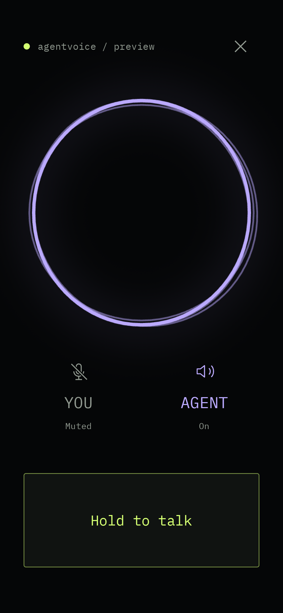

# AgentVoice for Android

A native, foreground voice client for the existing AgentVoice server. One screen:
YOU and AGENT mute controls, a fixed push-to-talk surface, and Vercel AI Elements'
Persona Halo. Kotlin/Compose and native Rive draw the interface; native WebRTC owns audio. Android
12 / API 31 or newer, ARM64 phones and x86-64 emulators.

This development build is installed on a Samsung Galaxy S22 running Android 16.
Native WSS/WebRTC connected to the desktop over Tailscale. Real-device checks
verified permission denial, PTT hold/release, background teardown, grant
revocation and rejection of the revoked grant. A human spoken request with an
audible answer and the remaining route/failure cases still require acceptance.
See [verification evidence](VERIFICATION.md). A preview's Connected label is synthetic.



## Build and verify

Use JDK 17 and Android SDK platform/build-tools 36. The Gradle 8.13 wrapper is
checksum-pinned. Set `ANDROID_HOME` to your installed SDK or configure an untracked
`local.properties` file.

```sh
cd android
./gradlew :app:assembleDebug :app:assembleRelease
./gradlew :app:testDebugUnitTest :app:lintDebug
./gradlew :app:assembleDebugAndroidTest
```

The installable development APK is
`app/build/outputs/apk/debug/app-debug.apk`, package
`com.arthack.agentvoice.dev`. It is separate from the unsigned release package
`com.arthack.agentvoice`. Release signing/distribution is not configured.
The desktop/Termux CLI's `bun run android:build` remains a different artifact.

Root `bun run test`, `bun run typecheck`, and `bun run lint` include the shared
contract fixtures. Both Kotlin and the server Zod schemas validate
`contract/server-frames.json`.

On an explicitly selected disposable emulator, with microphone/audio disabled:

```sh
adb -s <emulator-id> install -r app/build/outputs/apk/debug/app-debug.apk
adb -s <emulator-id> install -r app/build/outputs/apk/androidTest/debug/app-debug-androidTest.apk
adb -s <emulator-id> shell am instrument -w -r \
  com.arthack.agentvoice.dev.test/androidx.test.runner.AndroidJUnitRunner
```

Always select a device; never let `connectedAndroidTest` select every attached
phone. Installation on a personal phone is a separate explicit step.

## Connect

Follow [the Android handoff](../docs/android-client-handoff.md) to explicitly
enable the server's dedicated Tailscale WSS route and issue a device grant.
Transfer only the private JSON file through a trusted encrypted channel.

Open the app, choose **Import device grant**, and select that file using Android's
file picker. The app validates its exact shape and WSS endpoint, then encrypts
it with an Android Keystore AES-256-GCM key in app-private, no-backup storage.
No URL, grant, SDP, audio, or transcript is logged. The production activity
blocks screenshots and recents capture. Imports do not create a call. The source
file remains yours; the app does not delete or retain a URI permission for it.

Tap **Start voice** to request microphone and optional nearby-device permission
and start one call. Tailscale and upstream Internet access must be available.
The server controls conversation selection and persistent mute defaults.

YOU toggles the persistent microphone mute; AGENT toggles playback mute. While
YOU is muted and media is connected, hold the bottom surface to talk. Release,
pointer cancellation, a second pointer or focus loss closes the local hold
immediately. A delayed acknowledgement cannot reopen it. TalkBack exposes explicit
Start talking / Stop talking actions with the same gates.

The screen stays awake during a call. System bars can be revealed by swiping.
End call, Back, backgrounding, lock, transport loss, failed heartbeat, audio focus
loss or removal of the selected audio device tears down locally. Reopening the
app requires an explicit Start. Activity recreation, including a configuration
change that recreates it, also ends the call in this version. This can interrupt
server-owned agent work; it is the existing frontend ownership contract.
Portrait is the primary layout; shallow landscape screens scroll to keep every
control reachable. Connection is a small filled green indicator beside the name;
disconnected is an outlined indicator. TalkBack announces the actual phase, and
connecting phases remain readable in the header. Errors appear only when needed.

Expired/revoked grants require explicit replacement. The app has no enrollment,
refresh-secret, server configuration, account, approval or transcript interface.
The desktop's `agentvoice --attach` opens voice and orchestrator panes for the
phone's call; `agentvoice --attach --host smolbird` uses verified SSH when the
backend runs on that phone. The new CLI version must be installed on both ends
for remote viewing. This view owns no audio and closing it leaves the phone's
call running. Stock Codex TUI handles native approvals. See
[desktop attachment](../docs/composition.md).

## Implementation boundaries

- `Protocol.kt`: strict owner-frame decoder, endpoint validation, heartbeat,
  rate/pending limits and request correlation. Unknown/malformed frames terminate
  the connection; responses for methods this client never sent are invalid.
- `SecureTransport.kt`: verified WSS, exactly `agentvoice.v2`, Bearer header,
  no Origin, redirect, retry, caching or interceptors. Queued callback bytes and
  outgoing bytes are bounded. OkHttp delivers complete messages: the 1 MiB
  incoming check is after library reassembly, not an allocation bound inside
  OkHttp's WebSocket parser.
- `AudioGate.kt` / `CallController.kt`: server-authoritative gates with local
  restrictions, per-call generations, per-press acknowledgement fencing, one
  owner connection, no replay/reconnect. Runtime replacement retains ownership.
- `VoicePeer.kt`: one call-owned audio device/factory, at most a live and pending
  peer, one gathered offer per session, exact answer matching, bounded negotiation,
  and stale-callback fences. The direct WebRTC path never sends audio over WSS.
- `VoiceScreen.kt` / `PersonaHalo.kt`: the original bundled Persona Halo asset
  runs through native Rive, with no WebView or remote content. Violet speaking
  follows enabled playback RMS, with a short release hold between syllables;
  acid-green listening follows the open microphone gate. White idle is ambient
  presence; disconnected is a muted still. There is no inferred thinking state.
  The first native pose settles before drawing, avoiding a tiny startup ring.
  Window and system splash backgrounds use the same dark canvas.
  Disabled system animations and backgrounding settle the visual to one still
  frame. Persona uses the full width and the space freed by the status row. The
  padded artboard is enlarged to bring the ring near screen width. Its animation
  may bleed past the top and sides and underneath the header or buttons, which
  render and receive touches above it. There is no panel crop or edge mask.
  The disconnected still is smaller so startup details remain clear.
  The operator's chosen sizes are 78% for Speaking/Idle and 58% for Listening,
  with a fixed +35 dp vertical offset in every state. Each state has its own
  size multiplier; ordinary size changes ease over 300 ms, respecting reduced
  motion and lifecycle pause. Listening to Idle starts enlargement at Rive's
  actual `listening_out` state, spanning the asset's one-second exit. Listening
  to Speaking instead waits for `listening_off` before its 300 ms enlargement,
  so the incoming speech animation does not magnify the outgoing rings.
  Speaking animation and color start immediately; only growth waits. The
  transform affects the whole Halo. Stale callbacks are discarded on state changes.
  Entering Listening reaches its smaller scale before starting the ripples.
  Color still follows the audio gate immediately, and cancelling the entry
  prevents the pending ripple animation from starting.
  Disconnected uses Idle's multiplier with the smaller artboard.
  No audio samples reach Rive.

The UI uses IBM Plex Mono under the SIL Open Font License in `fonts/OFL.txt`,
downloaded from the Google Fonts `ofl/ibmplexmono` source. WebRTC is the pinned
`io.github.webrtc-sdk:android:150.7871.01` distribution (BSD-3-Clause). The
[Persona asset and Rive provenance](third-party/persona-halo.md) distinguishes
Apache-2.0 AI Elements component code, the MIT Rive runtime, and the separately
hosted Halo asset whose current license is not explicit in the inspected
sources. It records the Surge Studio/Vercel provenance and AgentVoice's
2026-09-09 modifications for the Contained Halo debug variant. The original
asset and production defaults are preserved; palette-only redraws retain the native pose. Full code/runtime licenses
and the separate Halo attribution notice ship in the APK's `assets/notices`.

## Design previews

Debug builds alone include `DesignPreviewActivity`. It imports only the screen
and synthetic view state; it cannot load a grant, create a controller, open audio,
or connect to a server. Scenarios: `setup`, `ready`, `connecting`, `live`, `talk`,
`error`. Force-stop only this development package in the disposable emulator
between scenarios, because launching an already topmost activity retains its state.

```sh
adb -s <emulator-id> shell am start \
  -n com.arthack.agentvoice.dev/com.arthack.agentvoice.DesignPreviewActivity \
  --es scenario live
```

See [the implementation decision](../docs/adr/0035-native-android-voice-client.md).

## Persona tuning and design studio

The [separate host configurator](configurator/README.md) runs in your desktop
browser and controls a full-screen native preview over ADB. It replaces the
on-phone tuner panel. The preview labels its microphone **HUMAN** and uses
readable on/off/live/wait captions that remain visible with larger system text.
Both mute buttons and **Push to talk** use Rockers:
press and keep the talk surface down to talk, release to mute. When the mic is
already open, touching Live now gives a subtle visual acknowledgement without
changing the mic or entering PTT. Active styling stays
dark with focused lime accents. Traces is the fixed composition: Parallel,
Splayed and Circuit routes share independent stance, weight and lighter offshoot
controls. Persona contact spacing and Button foot spacing (50–200%, default 100%)
separate neighboring routes at each end. Wider stance reserves room for the feet;
protected-center clearance can limit upper spacing at large Persona sizes. Routes reach the selected Persona placement, preserving its clear
center and glow. These stationary neutral layers change no layout, renderer,
tuning or touch target and preserve full bleed. Original retains a conservative
shared envelope, so unequal state sizes can leave a larger gap or no visible
routes when the envelope reaches the deck.
Controls size spans 240–480 dp, including the baseline 16 dp join; Push-to-talk
share spans 30–60% of that size basis. Extra join space changes total deck height
while preserving both button-face heights. Provisional portrait defaults use
387 dp and a 40.9% talk share; landscape retains 262 dp and `116 / 262 × 100`. **Reset button sizes** restores only those two dimensions,
keeping composition, light and Persona tuning. Control sizing preserves the Halo
diameter; button-style, preset and header selectors are removed.

**Halo** selects Original or Contained. Original preserves the current animation
and its separate state sizes. Contained keeps one common size (78% initially),
moves listening rings and pulse inward, and exposes Ring spread (35%), Listening
pulse (25%), Speaking motion (25%) and Idle breathing (25%), each from 0–100%.
Contained also offers Speaking/Listening/Idle color pickers initialized to the
existing violet/lime/warm-white palette. Switching variants retains both sets of
choices. Only Contained uses the patched in-memory asset. Theme colors are applied
after channel following and do not alter the underlying palette or animation asset.

The preview has no header. **Preview connection** selects synthetic Connected,
Connecting or Disconnected. A notice with a static glyph slides down from the
top and stays while Connecting or Disconnected, then slides away on Connected
without a success toast. Its 240 ms transition reserves no space and shifts
neither Halo nor the controls. This selection is not saved in the profile and
does not change the actual ADB connection.

Choose Speaking, Listening or Idle and adjust that state's
size (35–120%); Original keeps independent state sizes and Contained shares one. The vertical position slider applies
to every state, from −200 to +200 dp in 1 dp steps. Portrait starts at −22 dp;
landscape starts at 0 dp. Negative
moves up; positive moves down. **Reset size** restores Contained's shared size
or only the current Original state's size. **Reset position** restores the active orientation’s default.
**Reset animation** affects only the four Contained motion fields; **Reset colors**
affects only its three colors. Each reset preserves all other choices and stays
unsaved until explicit Save.
The phone's synthetic channel and
Push to talk buttons still work, and changes appear in the browser.
Leave the host app and browser open through backgrounding, activity recreation
or temporary USB loss. The configurator waits for the same preview to return,
reconnects automatically and retains unsaved tuning and design. It never replays Save or
brings the app to the foreground. A force-stop or dismissed task requires a
fresh host launch.

```sh
# From the repository root, with the current debug APK installed:
bun run android:configure --device <adb-serial>
```

Explicit Save retains the design, all three sizes and shared position in a
version 13 app-private `files/persona-tuning.json` and a matching JSON copy on the
host, including the fixed Rockers, composition, dimensions and Halo
variant, motion, colors and spirit settings, plus nested trace choices. Preview protocol 14 carries those
choices plus transient connection and synthetic activity selections. Portrait
reserves a screen-width square; landscape places Persona beside the Rocker deck.
Their tuning is independent. The browser edits only the orientation reported
by the connected phone, with epoch checks rejecting delayed rotation requests.
Version 13 stores portrait in the root fields and a separate `landscape` layout.
Side swapping is supported in the model; its selector stays hidden for now. Existing
version 1–12 phone profiles load without rewriting; retired button styles map to
Rockers and compositions to baseline Traces in memory. Version 9 preserves its
existing traces and adds only the two 100% spacing defaults. Versions 1–4 initially select Original; versions 5–10 keep
their Halo settings. Versions 1–3 use the control geometry baseline; versions
4–10 keep their dimensions. Versions 7–10 retain their spirit settings. Older profiles
become version 13 only on Save. The real client and release
APK keep their existing layout, behavior and compiled defaults until the operator
chooses a design for explicit adoption in code; their labels now also say Push to talk.
Debug builds include a **Halo preview** launcher
icon; the former `PersonaTunerActivity` is replaced by `PersonaPreviewActivity`.
The preview and its narrowly scoped ADB bridge are absent from release builds.
They never load a grant, controller or audio, or connect to the voice server.

**Padding** links the deck's outer sides, bottom clearance and every button gap
with one 0–40 dp control. Fresh defaults and Reset padding use 16 dp. Existing
profiles preserve their different margins/gaps as Custom until Padding is moved;
loading never rewrites them. Extra section separation remains 0–80 dp as before.
Both controls have individual resets and Reset spacing affects only this group in
the visible orientation. Persona's square, center, scale and manual offset remain
unchanged. System safe insets and control-width constraints still apply; tall decks
scroll to their padded bottom. The fixed square may leave extra space above the deck.

Session-only **Theme** compares Bright, Quiet and Grayscale. Bright preserves the
current palette exactly. Quiet reduces color and Halo intensity; Grayscale makes
all preview layers neutral and dims decorative light, while captions retain a
contrast floor. **Muted presence** compares Tide and Off. Tide shows lowercase
`muted` inside the ring only while connected with both effective audio gates
closed and no pending controls. Its Float motion follows a 14-second cycle by default, stays
still under reduced motion and disappears immediately for PTT or an open channel.
Measured text keeps an 8 dp clearance within a conservative inner aperture;
if it cannot fit at a small size or large font scale, it is omitted rather than
shrunk. **Muted appearance** adds 12–32 sp text, brightness (−100–100%),
drift (0–300%), breathing (0–100%) and a 6–30 second cycle, plus Float/Ripple.
Ripple sends a quiet wave through the letters; breathing gently lifts brightness
and scale. Each value and the whole appearance group have independent resets.
Negative brightness dims the entire breathing cycle; −100 hides the text and
zero retains the original ink. The baseline remains 14 sp, brightness 0, drift 100, breathing 0, 14 seconds, Float.
Cycle changes preserve the current phase instead of jumping to a different pose.
Contained's aperture follows the selected motion's conservative hard-stroke bounds;
large text is admitted only when its measured shape, movement and clearance fit.
Diffuse glow may remain behind it. These session selections survive rotation and
activity restoration but are not saved in a profile; profile version is 13.

The studio also offers a dim breathing **Background glow**, independent of the
trace routes, **Button light: Soft** and **Persona color:
Follow channels** experiments. Light drifts lazily within active button faces;
Contained colors softly reflect effective channel gates without replacing the
user palette. Strength affects only button light. **Synthetic voice** rehearses
level response without audio. **Reset light** and **Reset color behavior** affect
only their named settings. Versions 1–6 load with Still/Fixed behavior. The shared
clock stops in the background, disconnected or disabled; reduced motion removes
all added drift and level modulation. See the [studio guide](configurator/README.md).

## Remaining on-device acceptance

Use the handoff's full matrix for permission revocation during a call, audio focus
and Bluetooth changes, lock, Wi-Fi/cellular/Tailscale loss, silent half-open WSS,
grant revocation during negotiation, server redial/runtime restart and stale SDP
callbacks. The controller's delayed-response and stale-session cases are covered
with fake media; those do not establish native audio behavior. Background teardown
and active-call revocation were checked against desktop process identity and
saved voice JSONL. Finish with a human spoken command and an audible answer.
